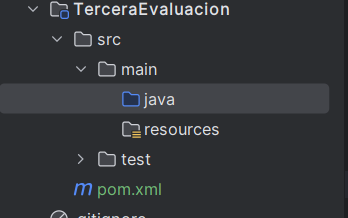

# O que é uma Interface?
Hoy día 13/03 empezamos clases de interfaces: 
Las clases si extends: herencia
la interfaz si emplementa : interface

Puede extender y implementar a la vez.

java: codigos
resources: imagenes

FUNCIONALIDAD: es método
entonces es como una interfaz de métodos.

