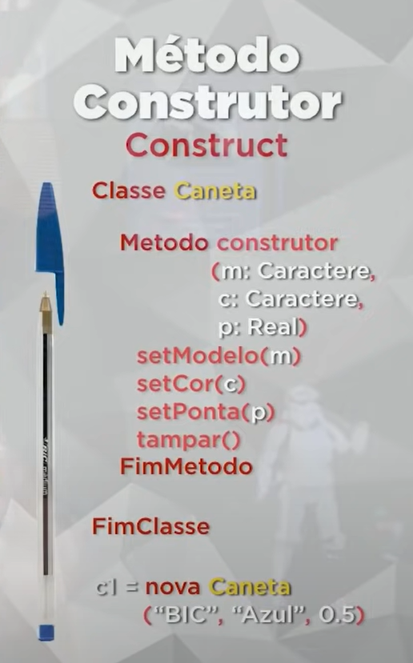

# EXPLICACIÓN ABOUT GETTERS Y SETTERS...
O Cara falando dessa sentencia para instanciar.
 
`e = nova Estante`

`t = e.totDoc`

## Métodos acessores(acessar algo): GETTERS / PEGAR ALGO

Con get. Serve para você pegar algo, visualizar algo, sem o alterar.
Náo dá aceso directo al objeto, garantizando seguranza.

`e = nova Estante`

`t = e.getTotDoc()`

## Métodos modificadores (modificar os valores): SETTERS / CAMBIAR ALGO

Como mariposa yo me transformo, make the dragqueen yo me transformo.

* Sin setters: Sin organización 

`e = nova Estante`

`e.totDoc = e.totDoc + 1`

* Con setters: garantiza seguranza en los cambios y organización **CASI SIEMPRE TIENE PARÁMETROS**:

`e = nova Estante`

`e.setTotDoc(doc)` con parámetros es necesario el tenermos el documento, para podermos cambiarlo.

## EJEMPLO DE TODO:
........................................................................................

## Métodos constructores : CONSTRUCT 

Creo um modelo de instanciamento.

........................................................................................

