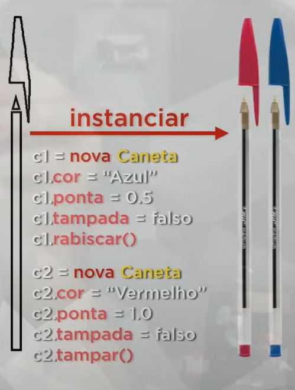

/*TODO OBEJTO VEM DE UMA CLASSE*/

    /*ATRIBUTOS DE UMA CANETA: substantivos
    * # Modelo: String
    * # Cor: String
    * # Ponta: double
    * # Carga: int
    * # Tampada: boolean
    * */

    /*METODOS DE UMA CANETA: verbos
    * # Escrever ()
    * # Rabiscar ()
    * # Pintar ()
    * # Tampar ()
    * # Destampar ()
    * */

    /* ¿ESTADO?/STATUS
    * Caracteristicas atuais do objeto, que dependem de um atributo
    *
    * INSTANCIAR: pega uma clase e gera um objeto a partir dela
    * new: instanciar
    * */
 
 