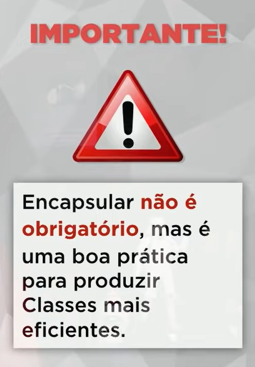

# ENCAPSULAMIENTO  / INTERFACES
Primeiro para a gente pensar em encapsulamiento pensamos em uma pilha.
* Proteger a pilha de você e você da pilha.

`Encapsular es:` Ocultar partes independentes da implementação, permitindo construir partes **invisíveis ao mundo exterior**.

