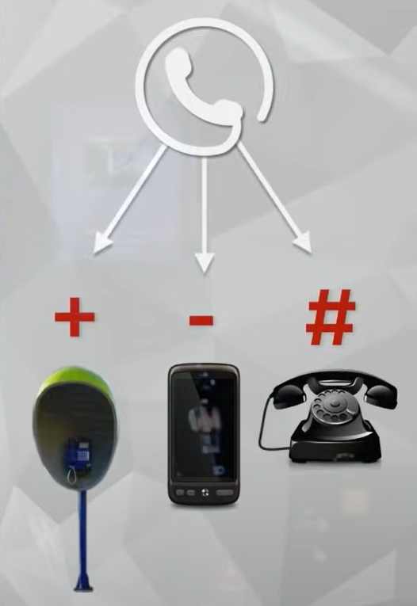

# VISIBILIDAD EN POO
Temos três tipos de visibilidad más utilizadas.
  
`-private:` Só te deixa mudar e instanziar o objeto dentro da classe onde vc criou
  
`+public:` Deixa todo mundo mudar, ver as informaciones
  
`#protect:` Es un relacionamento familar, solo la madre(super.clase), o los hijos (sub.clases), tienen aceso a ella. A um adendo importante, se voce criar no main a clase caneta, é como se fossem os hijos de la clase caneta, mesmo que eu nao coloco extends ainda é como se fossem los hijos, só que filhos de outro pai.
