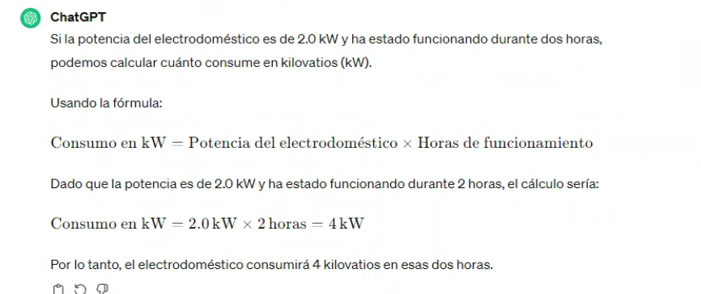
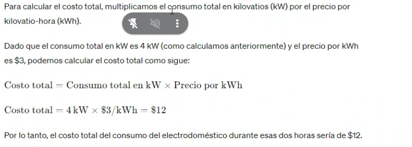
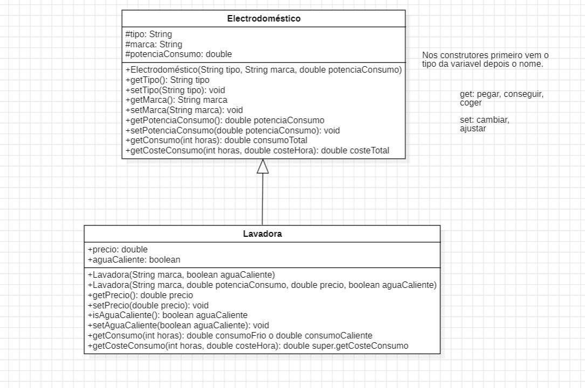

# 02 - EJERCICIO DE PROGRAMACIÓN JAVA

Electrodomésticos.
Práctica con clases básicas y herencia de clases
Electrodomésticos
Suponga que debe programar una aplicación para una empresa dedicada a
la venta y montaje de electrodomésticos. Esta aplicación necesitará
controlar las características que definen un electrodoméstico y que vendrán
dada por la clase Electrodoméstico que se específica a continuación.
Clase Electrodoméstico
Programe la clase Electrodoméstico teniendo en cuenta que tiene las
siguientes propiedades:

 Tipo. Cadena de texto que indica el tipo de electrodoméstico que es
(una nevera, un horno, una lavadora, etc.)

 Marca. Cadena de texto que indica la marca.

 Potencia. Número con decimales que indica la potencia de consumo
en kW por hora.

Constructor
Programe un constructor que reciba como parámetro un tipo, marca y
potencia y los asigne a cada propiedad.
Métodos get y set
Programe métodos set y get para cada propiedad.
Método toString
Programe el método toString de forma que devuelva una cadena con todas
las características del electrodoméstico.

<h2>SEGUNDA PARTE</h2>

Método getConsumo(int horas)
Este método recibirá una cantidad de horas de funcionamiento y devolverá
el total de kW consumido por el electrodoméstico en ese tiempo.
Método getCosteConsumo(int horas, double costeHora)
Este método recibirá una cantidad de horas así como el precio del kW/hora
y devolverá el coste total por el consumo del electrodoméstico en ese
tiempo.
NOTA. Pruebe los diferentes métodos de la clase en un programa de
prueba.

<h2>Clase Lavadora</h2>
Supongamos que necesita programar una clase Lavadora para una nueva
aplicación. Ya que una lavadora es un electrodoméstico, tendrá que usar la
herencia para aprovechar las características de la clase 

Electrodoméstico.

Propiedades
La clase Lavadora tendrá todas las propiedades de un electrodoméstico y
además:

 Precio. Es el precio correspondiente al precio de la lavadora.

 aguaCaliente. Booleano que indica que la lavadora está funcionando
con agua caliente (true) o fría (false)
Constructores
La clase Lavadora tendrá dos constructores.

 El primer constructor recibirá como parámetro la marca de la
lavadora y su potencia. Además, este constructor inicializará el
modo de funcionamiento a agua fría.

 El segundo constructor recibirá como parámetros la marca de la
lavadora, su precio, su potencia y su modo de funcionamiento (agua
fría o caliente)
Métodos set y get
La clase Lavadora tendrá los mismos set y get que la clase Electrodoméstico,
y además tendrá un set y get para las propiedades Precio y aguaCaliente.

Método toString
La clase Lavadora tendrá un método toString que devuelva una cadena con
todas las características de la lavadora.

<h2>PARTE 3</h2>
Método getConsumo(int horas)
Este método debe reprogramarse, ya que el cálculo del consumo de una

lavadora depende no solo de las horas de funcionamiento, sino también
del modo de funcionamiento. Así pues:

- Si la lavadora está funcionando con agua fría, el consumo es Horas *
  Potencia.
- 
- Si la lavadora está funcionando con agua caliente, el consumo es
  Horas * (Potencia + Potencia * 0,20)
- 

  Método getCosteConsumo(int horas, double costeHora)
  Este método no necesita ser sobreescrito, por lo que debería funcionar
  correctamente.
- 
- 
  NOTA. Compruebe el funcionamiento de la clase Lavadora en un
  programa de prueba. 

<h2>DIAGRAMA DE CLASES</h2>

