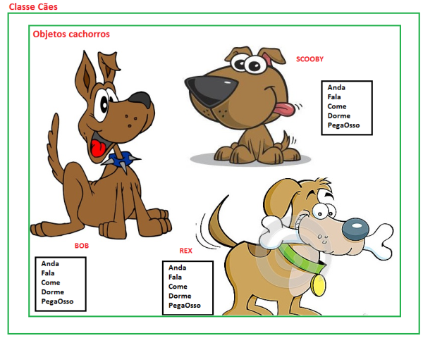
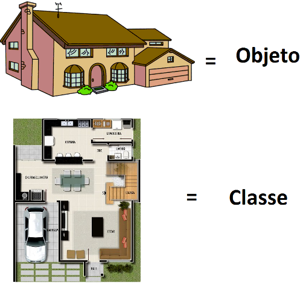

# Classes

As classes de programação são projetos de um objeto, aonde têm características e comportamentos, ou seja, permite armazenar propriedades e métodos dentro dela. Para construir uma classe é preciso utilizar o pilar da abstração. Uma classe geralmente representa um *SUSTANTIVO*, por exemplo: uma pessoa, um lugar, algo que seja “abstrato”.

# Características das classes
1. Toda classe possui um nome;
2. Possuem visibilidade, exemplo: public, private, protected;
3. Possuem membros como: Características e Ações;
4. Para criar uma classe basta declarar a visibilidade + digitar a palavra reservada class + NomeDaClasse + abrir e fechar chaves { }.

# Objetos

Os objetos são características definidas pelas classes. Neles é permitido instanciar objetos da classe para inicializar os atributos e invocar os métodos.

*Se llama instancia a todo objeto que derive de algún otro. De esta forma, todos los objetos son instancias de algún otro, menos la clase Object que es la madre de todas.*

Todo objeto é algo que existe, uma coisa concreta, já a classe é considerada como um modelo ou projeto de um objeto, sendo algo que não consegue tocar.

# Atributos

Os atributos são as propriedades de um objeto, também são conhecidos como variáveis ou campos. Essas propriedades definem o estado de um objeto, fazendo com que esses valores possam sofrer alterações. 

# Métodos 
Os métodos são ações ou procedimentos, onde podem interagir e se comunicarem com outros objetos. A execução dessas ações se dá através de mensagens, tendo como função o envio de uma solicitação ao objeto para que seja efetuada a rotina desejada.

Como boas práticas, é indicado sempre usar o nome dos métodos declarados como verbos, para que quando for efetuada alguma manutenção seja de fácil entendimento. Veja algumas nomenclaturas de nomes de métodos:

* acaoVoltar
* voltar
* avançar
* correr
* resgatarValor
* pesquisarNomes

# Construtores
O construtor de um objeto é um método especial, pois inicializa seus atributos toda vez que é instanciado (inicializado).

Toda vez que é digitada a palavra reservada new, o objeto solicita para a memória do sistema armazená-lo, onde chama o construtor da classe para inicializar o objeto. A identificação de um construtor em uma classe é sempre o mesmo nome da classe.

*Sempre uma classe terá um construtor padrão, mesmo não sendo declarado o compilador irá fornecer um. Esse construtor não recebe argumentos e existe para possibilitar a criação de objetos para uma classe.*
