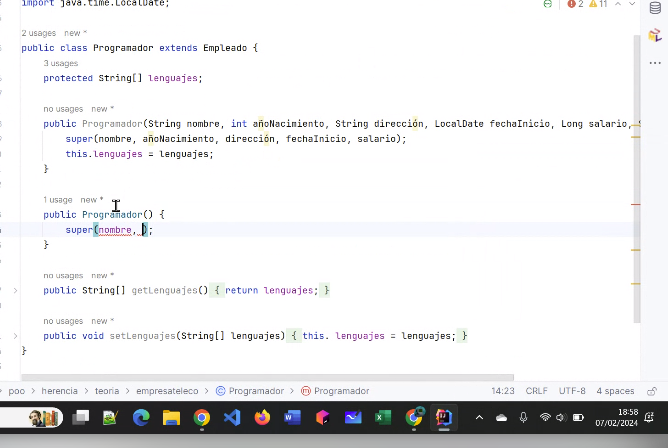
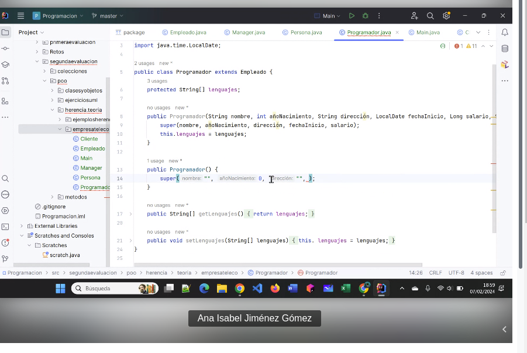
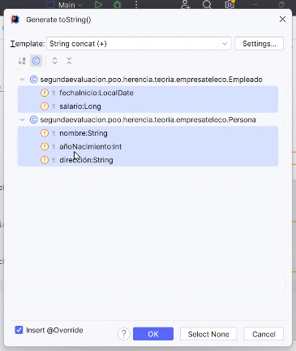
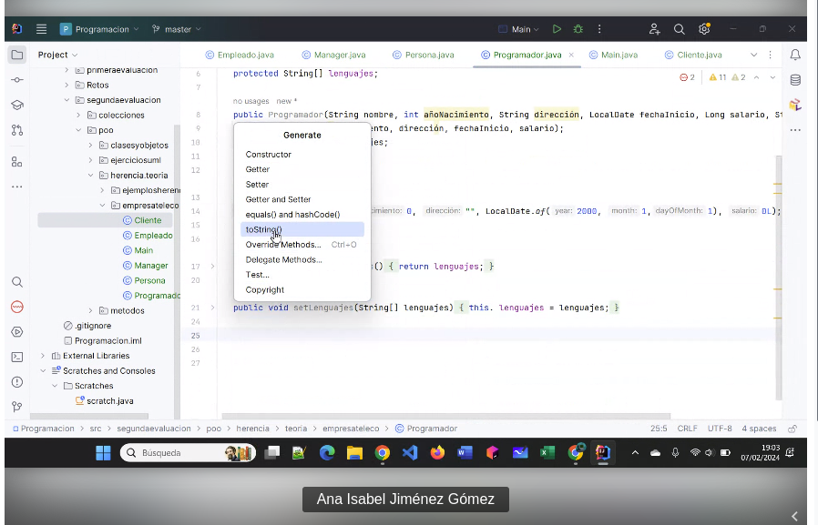
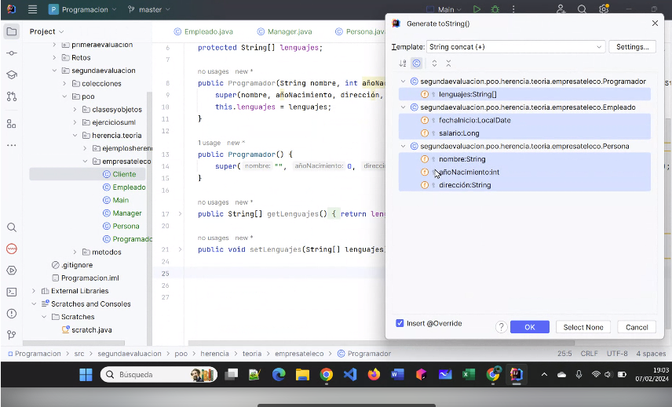
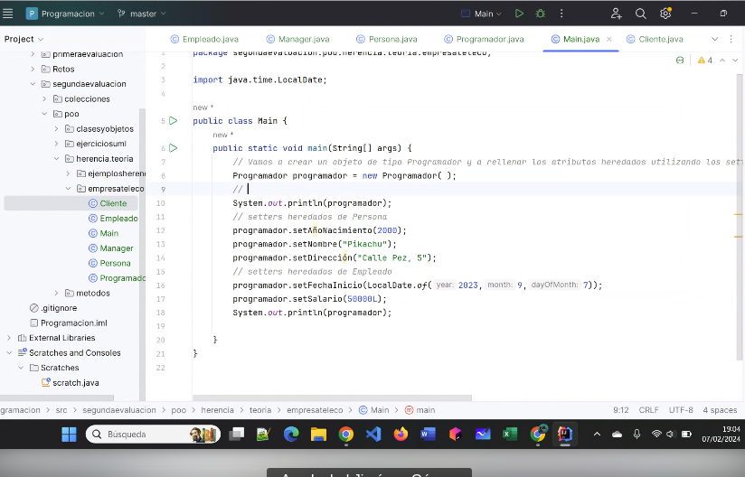
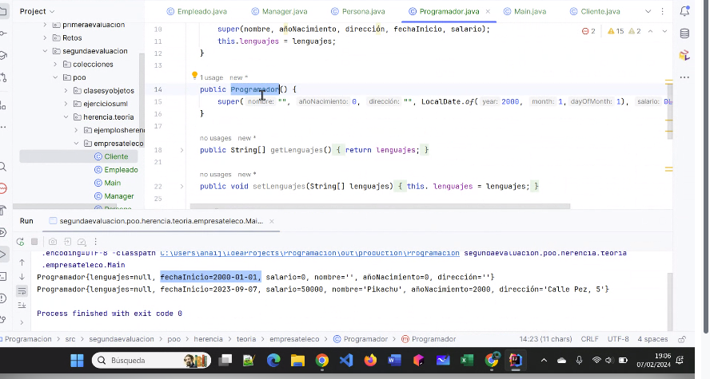
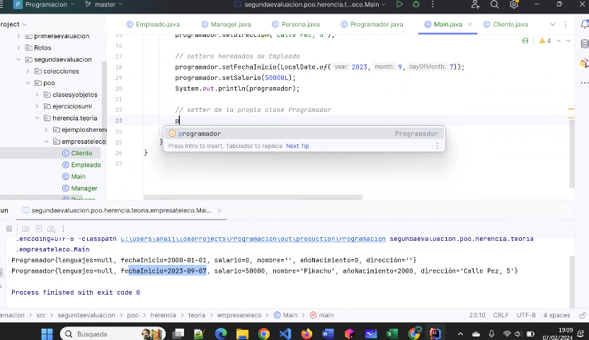

Explicación de la fecha del ejercicios de herencia:

El super seria de la super clase:
LocalDate, você ja sabe que é para criar uma variavél de data

Em todas clases colocamos um toString

<h1>Programador.java</h1>

<h1>Explicacao sobre a materia e print de tudo:</h1>

Depois em main fazemos o System.outPrintln
de cada elemento do programador.
E isso funciona porque criamos um toString

Super vem de super classe.

<b>programador.setLenguajes(new String[]{"Java","SQL","HTML")<b>
System.out.println(programador);
